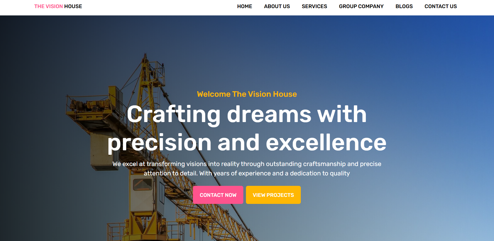
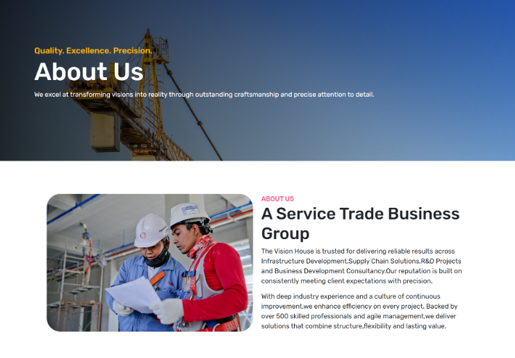
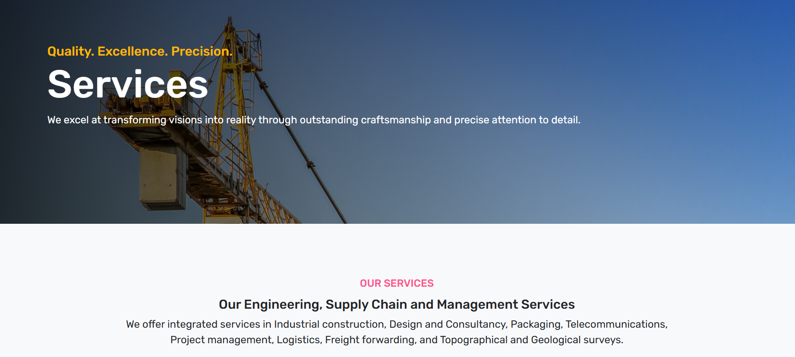
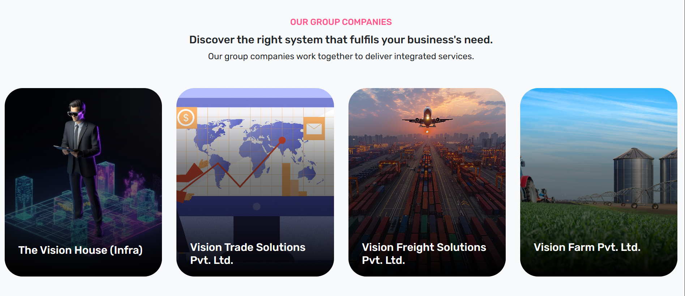
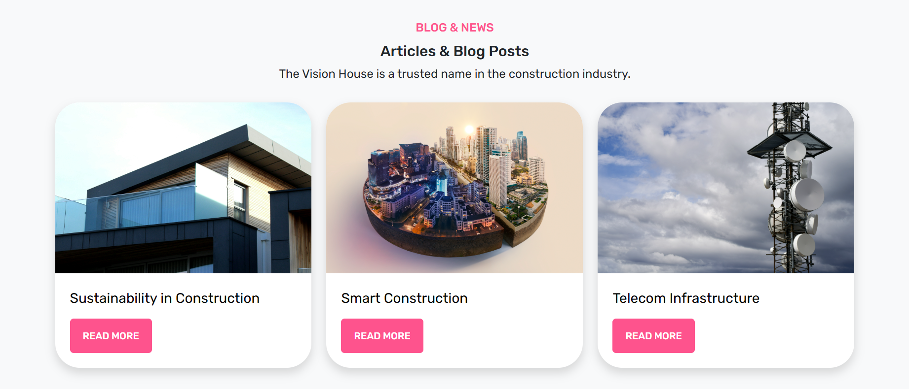
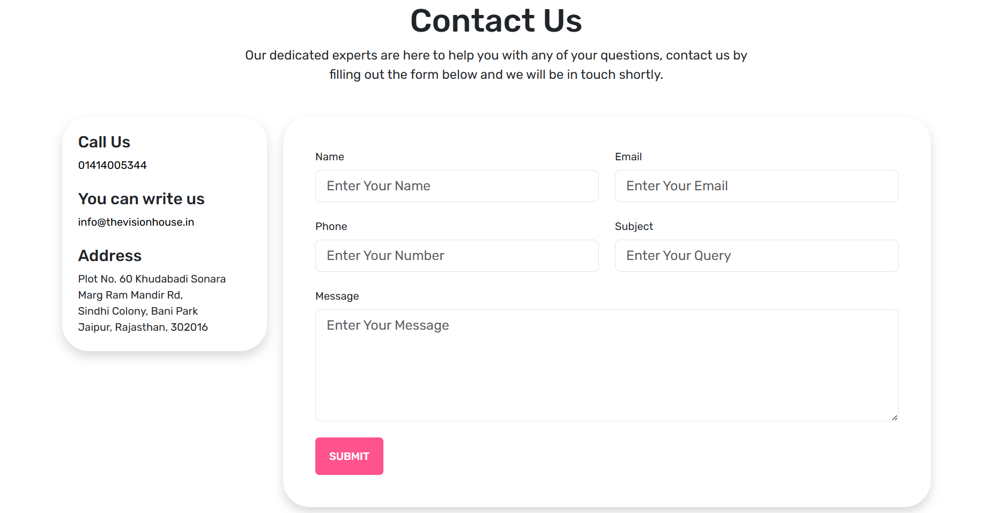

# 🚧 The Advance Web Rebuild

Welcome to **The Advance Web Rebuild** — a fully responsive, modular, and modern multi-page web platform built for **The Vision House**, a multidisciplinary enterprise in infrastructure, logistics, consultancy, and IT solutions.

> ✨ _A real-world frontend internship project focused on rebuilding the organization’s existing website for a stronger, scalable, and user-friendly digital presence._

---

## 🌟 Features

✅ **Component-based architecture** using `React.js`  
✅ **Responsive design** powered by `Bootstrap 5`  
✅ **Dynamic routing** with `React Router DOM`  
✅ **SEO-friendly multi-page layout**  
✅ **Interactive UI** with clean layouts and animated CTAs  
✅ **Validated contact form** and user-oriented structure  
✅ **Scalable project structure** for future backend integrations

---

## 📄 Project Pages

| Page           | Description                                                                          |
|----------------|--------------------------------------------------------------------------------------|
| 🏠 **Home**         | Hero section with highlights, intro to services, and smooth page flow             |
| 👥 **About Us**     | Mission, vision, and leadership highlights with a company overview                |
| 🛠️ **Services**      | Card-based structure showcasing business offerings                               |
| 🏢 **Group Companies** | Sub-company profiles in card format                                               |
| 📝 **Blogs**         | Static blog layout for company updates, insights, or future CMS integration       |
| 📞 **Contact Us**     | Form with field validation and responsive contact section                         |
| 🔐 **Login**          | Placeholder login UI for potential authentication system                         |

---

## 🔧 Tech Stack

### 💻 Frontend
- **React.js**
- **JavaScript (ES6+)**
- **HTML5 / CSS3**
- **Bootstrap 5**

### 🎨 UI/UX Design
- **Figma** — Wireframes & visual mockups  
- **Canva** — Presentation assets and visual content  

### 📁 Version Control & Deployment
- **Git + GitHub** — Source control, branches, collaboration

---

## 📸 Screenshots

### 🖼️ Home


### 🖼️ About Us 


### 🖼️ Services



### 🖼️ Group Companies


### 🖼️ Blogs Section 


### 🖼️ Testimonials


### 🖼️ Contact Us 

```

---

## ⚙️ Getting Started

### 🔍 Prerequisites
- [Node.js](https://nodejs.org/en/) (v16+)
- `npm` or `yarn`

### 📦 Installation

1. Clone the repository
    ```bash
    git clone https://github.com/TheAkashKumawat/The-Advance-Web-Rebuild.git
    cd The-Advance-Web-Rebuild
    ```

2. Install dependencies
    ```bash
    npm install
    ```

3. Run the development server
    ```bash
    npm run dev
    ```

### 🏗️ Build for Production

```bash
npm run build
```

---

## 📘 Learnings & Outcomes

- 🧩 Real-world frontend development experience  
- 🎯 Focused on **UI/UX best practices** and responsive design  
- 📐 Improved skills in **project planning** and **requirement analysis**  
- 🔁 Better understanding of **agile workflows** and teamwork dynamics  

---

## 🤝 Contributing

Pull requests are welcome! If you'd like to improve the project, report a bug, or add enhancements:

1. Fork the repository  
2. Create a new branch  
3. Make your changes  
4. Submit a pull request ✅

---

## 📄 License

This project is licensed under the **MIT License** – see the `LICENSE` file for details.

---

## 👨‍💻 Author

**Akash Kumawat**  
Frontend Developer Intern  
📍 [The Vision House](https://thevisionhouse.in)

> _“Empowering digital vision through clean, scalable design.”_

